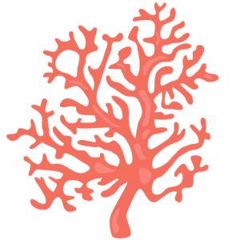
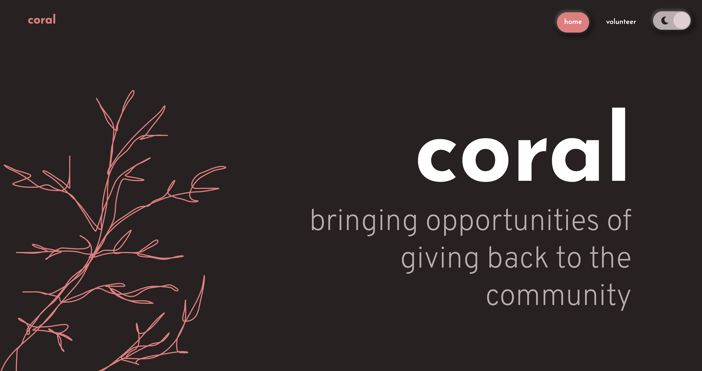
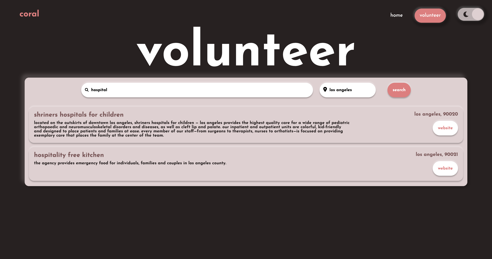

 

  

  <h3 align="center">Coral</h3>

  

    Bringing opportunities of giving back to the community.
     
     
    <a href="https://c0ral.glitch.me/">View Project</a>
    ·
    <a href="https://github.com/hudasir4j/coral/issues">Report Bug</a>
    ·
    <a href="https://github.com/hudasir4j/coral/issues">Request Feature</a>
  

<!-- ABOUT THE PROJECT -->

## About The Project

### Inspiration

We are very passionate about making a positive impact on society and the environment. Our main objective was to create a website that could allow you to find environmental volunteering opportunities near you & your interests/queries.

### What it does

We created a product/website that provides a list of volunteering opportunities after the user provides the website with their city, zip code, or any other keyword that may help them find relevant results.

### How our product was built

To build this website, we have used HTML, CSS (specifically SASS for more complex details), as well as some JavaScript for Functionality. In order to accomplish our goals, we had to use JavaScript and integrate an API into our code to create functional content for possible volunteering opportunities.

### Challenges we ran into

We were primarily focused on creating a website that gives environmental volunteering opportunities, however unfortunately, we could not find a non-profit API that would provide us with a list of environmental volunteer opportunities. We decided to use the API made by "City of Los Angeles Hub;" and instead of focusing on Environmental volunteer work, we decided to broaden our focus on all kinds of volunteer works because it seemed that most of the data was related to nutrition, children and healthcare.

### Accomplishments that we're proud of

We are mostly proud of our team work. We all supported this project and each other with our strengths while being understanding of eachothers' opportunities to learn from this hackathon rather than provide perfect performance.

Project-wise, we're really proud of how we were able to integrate an API into our project, and especially how we were able to come up with a way to filter through results depending on queries. We also thought that the presentation of the website came together pretty well. Incorporating a light & dark mode, neumorphism ui design, and responsive web design was quite a challenge, but we were able to successfully tie it all in at the end.

### What we learned

We learned about new tools and technologies that we found to be fascinating such as Glitch.com, Figma, SASS language, file structure, collaborative coding, github, and the City of Los Angeles Hub API.

### What's next for Coral?

We would like to invest our time in the future to see what resources we can use to broaden the region that volunteer opportunities can be suggested for users. At this point, it's only targeting Los Angeles. We would also like to learn more about resources that have more options for environmental volunteer opportunities, because of the endangerment of the planet that we live in. We want to fight for the environment that has been nurturing us with its equilibrium, for ourselves, and for our future generations.

### Built With

- JavaScript
- HTML
- CSS
- [Glitch](https://glitch.com/)

